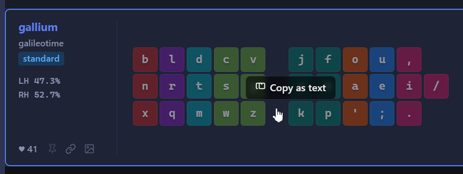

# Kanata Guide for Alt Layouts

This guide shows you how to use [alt layouts](https://layouts.wiki/guides/start/intro/) with [Kanata](https://github.com/jtroo/kanata), a tool for remapping any keyboard.

### In this guide

-   [Set up Kanata](#set-up-kanata)
-   [Run Kanata at startup](#run-kanata-at-startup)
-   [Change your layout](#change-your-layout)
-   [Basics of a Kanata config](#basics-of-a-kanata-config)
-   [Example configs](#example-configs)&NoBreak;&hairsp;&NoBreak;&mdash;&hairsp;includes toggling layouts, custom shift pairs, magic keys, and more

## Set up Kanata

Expand the section for your operating system.

<!----------------------------------------------------------------------------->
<!-- Windows -->

<details>
<summary><strong>Windows</strong></summary>
<p></p>

Kanata has two versions, one for x64 processors and one for arm64 processors.

1.  To check what processor your computer uses, expand the section for your version of Windows:

<ul>
<details>
<summary><strong>Windows 10</strong></summary>
<p></p>

1.  Open the **Settings** app.

    If you’re not sure how, right-click the **Start** icon on the taskbar and select **Settings**.

1.  In the navigation menu, click **System**.

1.  In the navigation panel that appears, scroll to the end and click **About**.

1.  In the **Device specifications** section, look for the **System type** item:

    -   “64-bit operating system, **x64**-based processor” means you’re using an **x64** processor.
    -   “64-bit operating system, **ARM**-based processor” means you’re using an **arm64** processor.

</details>
</ul>

<ul>
<details>
<summary><strong>Windows 11</strong></summary>
<p></p>

1.  Open the **Settings** app.

    If you’re not sure how, right-click the **Start** icon on the taskbar and select **Settings**.

1.  In the navigation panel, click **System**.

1.  Scroll to the end of the page and click **About**.

1.  In the **Device info** section, look for the **System type** item:

    -   “64-bit operating system, **x64**-based processor” means you’re using an **x64** processor.
    -   “64-bit operating system, **ARM**-based processor” means you’re using an **arm64** processor.

</details>
</ul>

2.  Download Kanata:

    -   If your computer uses an **x64** processor, [download the x64 version of Kanata](https://github.com/jtroo/kanata/releases/latest/download/windows-binaries-x64.zip).
    -   If your computer uses an **arm64** processor, [download the arm64 version of Kanata](https://github.com/jtroo/kanata/releases/download/v1.11.0/windows-binaries-arm64.zip).

2.  Extract the downloaded zip file. It contains the Kanata executable files.

2.  [Download the example config](https://github.com/zachpoblete/kanata-guide-for-alt-layouts/releases/download/download/example.kbd) and put it in the same folder as the Kanata executable files.

2.  Open the folder with the Kanata executable files in a terminal.

    If you’re not sure how, right-click an empty space inside the folder and select **Open in Terminal**.

2.  Run Kanata with the example config:

    -   If your computer uses an **x64** processor, run the following command:

        ```cmd
        .\kanata_windows_gui_winIOv2_cmd_allowed_x64.exe --cfg example.kbd
        ```

    -   If your computer uses an **arm64** processor, run the following command:

        ```cmd
        .\kanata_windows_gui_winIOv2_cmd_allowed_arm64.exe --cfg example.kbd
        ```

    The Kanata tray icon appears in the system tray.

Kanata is running the [Gallium layout](https://layouts.wiki/guides/start/recommendations/#gallium-and-graphite). Press your `q` key&NoBreak;&hairsp;&NoBreak;&mdash;&hairsp;it outputs `b`.

**To stop any Kanata config**, press the key combination `Left Control + Space + Escape`. Use the physical keys in those positions&NoBreak;&hairsp;&NoBreak;&mdash;&hairsp;it doesn’t matter what you configured those keys to do.

</details>

<!----------------------------------------------------------------------------->
<!-- Linux -->

<details>
<summary><strong>Linux</strong></summary>
<p></p>

1.  [Download Kanata](https://github.com/jtroo/kanata/releases/latest/download/linux-binaries-x64.zip).

1.  Extract the downloaded zip file. It contains the Kanata executable files.

1.  [Download the example config](https://github.com/zachpoblete/kanata-guide-for-alt-layouts/releases/download/download/example.kbd) and put it in the same folder as the Kanata executable files.

1.  Open the folder with the Kanata executable files in a terminal.

    If you’re not sure how, right-click an empty space inside the folder and select **Open in Terminal**.

1.  Run Kanata with the example config. You only need to run the `chmod` command the first time you run Kanata.

    ```shell
    chmod +x kanata_linux_cmd_allowed_x64
    sudo ./kanata_linux_cmd_allowed_x64 --cfg example.kbd
    ```

Kanata is running the [Gallium layout](https://layouts.wiki/guides/start/recommendations/#gallium-and-graphite). Press your `q` key&NoBreak;&hairsp;&NoBreak;&mdash;&hairsp;it outputs `b`.

**To stop any Kanata config**, press the key combination `Left Control + Space + Escape`. Use the physical keys in those positions&NoBreak;&hairsp;&NoBreak;&mdash;&hairsp;it doesn’t matter what you configured those keys to do.

</details>

<!----------------------------------------------------------------------------->
<!-- macOS 10 and older -->

<details>
<summary><strong>macOS 10 and older</strong></summary>
<p></p>

>   **⚠️ Warning**: It is unclear whether the latest version of Kanata works with macOS 10 and older. Support for macOS 10 was introduced in [Kanata v1.6.0](https://github.com/jtroo/kanata/releases/tag/v1.6.0), so try starting there&NoBreak;&hairsp;&NoBreak;&mdash;&hairsp;one user [confirmed Kanata working on macOS 10.15 Catalina](https://github.com/jtroo/kanata/issues/676#issuecomment-1868389437).

If you encounter any issues, see [Troubleshooting](https://github.com/jtroo/kanata/blob/main/docs/setup-macos.md#8-troubleshooting).

1.  Install the [Karabiner kernel extension (kext)](https://github.com/pqrs-org/Karabiner-VirtualHIDDevice-archived) for macOS 10&NoBreak;&hairsp;&NoBreak;&mdash;&hairsp;the [KMonad installation instructions](https://github.com/kmonad/kmonad/blob/master/doc/installation.md#macos) may be helpful.

1.  [Download Kanata](https://github.com/jtroo/kanata/releases/latest/download/macos-binaries-x64.zip).

    -   Note: This is the latest version.

1.  Extract the downloaded zip file. It contains the Kanata executable files.

1.  [Download the example config](https://github.com/zachpoblete/kanata-guide-for-alt-layouts/releases/download/download/example.kbd) and put it in the same folder as the Kanata executable files.

1.  Open the folder with the Kanata executable files in a terminal.

    If you’re not sure how, right-click an empty space inside the folder and select **Services → New Terminal at Folder**.
    -   If **New Terminal at Folder** doesn’t appear, click **Finder → Services → Services Settings → Files and Folders** and enable **New Terminal at Folder**.

1.  Run Kanata with the example config. You only need to run the `chmod` command the first time you run Kanata.

    ```shell
    chmod +x kanata_macos_cmd_allowed_x64
    sudo ./kanata_macos_cmd_allowed_x64 --cfg example.kbd
    ```

Kanata is running the [Gallium layout](https://layouts.wiki/guides/start/recommendations/#gallium-and-graphite). Press your `q` key&NoBreak;&hairsp;&NoBreak;&mdash;&hairsp;it outputs `b`.

**To stop any Kanata config**, press the key combination `Left Control + Space + Escape`. Use the physical keys in those positions&NoBreak;&hairsp;&NoBreak;&mdash;&hairsp;it doesn’t matter what you configured those keys to do.

</details>

<!----------------------------------------------------------------------------->
<!-- macOS 11 and 12 -->

<details>
<summary><strong>macOS 11 and 12</strong></summary>
<p></p>

>   **⚠️ Warning**: One user [reported Kanata not working on macOS 11](https://github.com/jtroo/kanata/discussions/1242); presumably, they were using Kanata v1.6.1 at the time. Ben Vallack explains [how he installed Kanata on macOS 12](https://www.youtube.com/watch?v=4yiMbP_ZySQ&t=1m23s).

If you encounter any issues, see [Troubleshooting](https://github.com/jtroo/kanata/blob/main/docs/setup-macos.md#8-troubleshooting).

The following sections show you how to set up the Karabiner driver and Kanata itself.

### Set up the Karabiner driver

To use Kanata, first set up the [Karabiner driver](https://github.com/pqrs-org/Karabiner-DriverKit-VirtualHIDDevice):

1.  [Download Karabiner driver v3.1.0](https://github.com/pqrs-org/Karabiner-DriverKit-VirtualHIDDevice/releases/download/v3.1.0/Karabiner-DriverKit-VirtualHIDDevice-3.1.0.pkg) and run the installer.

1.  Open a terminal and activate the driver:

    ```shell
    sudo /Applications/.Karabiner-VirtualHIDDevice-Manager.app/Contents/MacOS/Karabiner-VirtualHIDDevice-Manager activate
    ```

    If you previously ran the `deactivate` command, restart your computer.

1.  Enable the Karabiner system extension: open **System Preferences → General → Login Items** and enable `org.pqrs.Karabiner-DriverKit-VirtualHIDDevice`.

1.  [Download the Karabiner plist file](https://github.com/zachpoblete/kanata-guide-for-alt-layouts/releases/download/download/org.pqrs.Karabiner-VirtualHIDDevice-Daemon.plist) and save it in the `/Library/LaunchDaemons` folder.

1.  In the terminal, register the Karabiner daemon:

    ```shell
    sudo chown root:wheel /Library/LaunchDaemons/org.pqrs.Karabiner-VirtualHIDDevice-Daemon.plist
    sudo launchctl bootstrap system /Library/LaunchDaemons/org.pqrs.Karabiner-VirtualHIDDevice-Daemon.plist
    sudo launchctl list | grep org.pqrs
    ```

    The output lists the Karabiner daemon `org.pqrs.service.daemon.Karabiner-VirtualHIDDevice-Daemon`.

### Set up the Kanata executable

Kanata has two versions, one for arm64 processors and one for x64 processors.

1.  To check what processor your computer uses, follow these steps:

    1.  Click the **Apple icon** menu and select **About This Mac**.

    1.  In the window that appears, look for either a **Chip** or **Processor** item:

        -   **Chip** means you’re using an **arm64** processor.
        -   **Processor** means you’re using an **x86_64** processor.

1.  Download Kanata v1.7.0:

    -   If your computer uses an **arm64** processor, [download the arm64 Kanata executable file](https://github.com/jtroo/kanata/releases/download/v1.7.0/kanata_macos_cmd_allowed_arm64).
    -   If your computer uses an **x86_64** processor, [download the x86_64 Kanata executable file](https://github.com/jtroo/kanata/releases/download/v1.7.0/kanata_macos_cmd_allowed_x86_64).

1.  Enable Accessibility: open **System Preferences → Privacy & Security → Accessibility** and add the Kanata executable file.

1.  Enable Input Monitoring: open **System Preferences → Privacy & Security → Input Monitoring** and add the Kanata executable file.

1.  [Download the example config](https://github.com/zachpoblete/kanata-guide-for-alt-layouts/releases/download/download/example.kbd) and put it in the same folder as the Kanata executable file.

1.  Open the folder with the Kanata executable file in a terminal.

    If you’re not sure how, right-click an empty space inside the folder and select **Services → New Terminal at Folder**.
    -   If **New Terminal at Folder** doesn’t appear, click **Finder → Services → Services Settings → Files and Folders** and enable **New Terminal at Folder**.

1.  Run Kanata with the example config.

    -   If your computer uses an **arm64** processor, run the following command. You only need to run the `chmod` command the first time you run Kanata.

        ```shell
        chmod +x kanata_macos_cmd_allowed_arm64
        sudo ./kanata_macos_cmd_allowed_arm64 --cfg example.kbd
        ```

    -   If your computer uses an **x86_64** processor, run the following command. You only need to run the `chmod` command the first time you run Kanata.

        ```shell
        chmod +x kanata_macos_cmd_allowed_x86_64
        sudo ./kanata_macos_cmd_allowed_x86_64 --cfg example.kbd
        ```

Kanata is running the [Gallium layout](https://layouts.wiki/guides/start/recommendations/#gallium-and-graphite). Press your `q` key&NoBreak;&hairsp;&NoBreak;&mdash;&hairsp;it outputs `b`.

**To stop any Kanata config**, press the key combination `Left Control + Space + Escape`. Use the physical keys in those positions&NoBreak;&hairsp;&NoBreak;&mdash;&hairsp;it doesn’t matter what you configured those keys to do.

</details>

<!----------------------------------------------------------------------------->
<!-- macOS 13 and newer -->

<details>
<summary><strong>macOS 13 and newer</strong></summary>
<p></p>

If you encounter any issues, see [Troubleshooting](https://github.com/jtroo/kanata/blob/main/docs/setup-macos.md#8-troubleshooting).

The following sections show you how to set up the Karabiner driver and Kanata itself.

### Set up the Karabiner driver

To use Kanata, first set up the [Karabiner driver](https://github.com/pqrs-org/Karabiner-DriverKit-VirtualHIDDevice):

1.  If [Karabiner Elements](https://karabiner-elements.pqrs.org/) is installed, disable its background processes: Open **System Settings → General → Login Items & Extensions**. In the **App Background Activity** section, disable the following if you see them:

    -   **Karabiner-Elements Privileged Daemons**
    -   **Karabiner-Elements Privileged Daemons v2**

1.  [Download Karabiner driver v6.2.0](https://github.com/pqrs-org/Karabiner-DriverKit-VirtualHIDDevice/releases/download/v6.2.0/Karabiner-DriverKit-VirtualHIDDevice-6.2.0.pkg) and run the installer.

1.  Open a terminal and activate the driver:

    ```shell
    sudo /Applications/.Karabiner-VirtualHIDDevice-Manager.app/Contents/MacOS/Karabiner-VirtualHIDDevice-Manager forceActivate
    ```

    If you previously ran the `deactivate` command, restart your computer.

1.  Enable the Karabiner system extension: Open **System Settings → General → Login Items & Extensions**. In the **Extensions** section, enable `org.pqrs.Karabiner-DriverKit-VirtualHIDDevice`.

1.  [Download the Karabiner plist file](https://github.com/zachpoblete/kanata-guide-for-alt-layouts/releases/download/download/org.pqrs.Karabiner-VirtualHIDDevice-Daemon.plist) and save it in the `/Library/LaunchDaemons` folder.

1.  In the terminal, register the Karabiner daemon:

    ```shell
    sudo chown root:wheel /Library/LaunchDaemons/org.pqrs.Karabiner-VirtualHIDDevice-Daemon.plist
    sudo launchctl bootstrap system /Library/LaunchDaemons/org.pqrs.Karabiner-VirtualHIDDevice-Daemon.plist
    sudo launchctl list | grep org.pqrs
    ```

    The output lists the Karabiner daemon `org.pqrs.service.daemon.Karabiner-VirtualHIDDevice-Daemon`.

### Set up the Kanata executable

Kanata has two versions, one for arm64 processors and one for x64 processors.

1.  To check what processor your computer uses, follow these steps:

    1.  Click the **Apple icon** menu and select **About This Mac**.

    1.  In the window that appears, look for either a **Chip** or **Processor** item:

        -   **Chip** means you’re using an **arm64** processor.
        -   **Processor** means you’re using an **x64** processor.

1.  Download Kanata:

    -   If your computer uses an **arm64** processor, [download the arm64 version of Kanata](https://github.com/jtroo/kanata/releases/latest/download/macos-binaries-arm64.zip).
    -   If your computer uses an **x64** processor, [download the x64 version of Kanata](https://github.com/jtroo/kanata/releases/latest/download/macos-binaries-x64.zip).

1.  Extract the downloaded zip file. It contains the Kanata executable files.

1.  Enable Accessibility: open **System Settings → Privacy & Security → Accessibility** and add the Kanata executable file whose filename starts with `kanata_macos_cmd_allowed_`.

1.  Enable Input Monitoring: open **System Settings → Privacy & Security → Input Monitoring** and add the Kanata executable file whose filename starts with `kanata_macos_cmd_allowed_`.

1.  [Download the example config](https://github.com/zachpoblete/kanata-guide-for-alt-layouts/releases/download/download/example.kbd) and put it in the same folder as the Kanata executable files.

1.  Open the folder with the Kanata executable files in a terminal.

    If you’re not sure how, right-click an empty space inside the folder and select **Services → New Terminal at Folder**.
    -   If **New Terminal at Folder** doesn’t appear, click **Finder → Services → Services Settings → Files and Folders** and enable **New Terminal at Folder**.

1.  Run Kanata with the example config.

    -   If your computer uses an **arm64** processor, run the following command. You only need to run the `chmod` command the first time you run Kanata.

        ```shell
        chmod +x kanata_macos_cmd_allowed_arm64
        sudo ./kanata_macos_cmd_allowed_arm64 --cfg example.kbd
        ```

    -   If your computer uses an **x64** processor, run the following command. You only need to run the `chmod` command the first time you run Kanata.

        ```shell
        chmod +x kanata_macos_cmd_allowed_x64
        sudo ./kanata_macos_cmd_allowed_x64 --cfg example.kbd
        ```

Kanata is running the [Gallium layout](https://layouts.wiki/guides/start/recommendations/#gallium-and-graphite). Press your `q` key&NoBreak;&hairsp;&NoBreak;&mdash;&hairsp;it outputs `b`.

**To stop any Kanata config**, press the key combination `Left Control + Space + Escape`. Use the physical keys in those positions&NoBreak;&hairsp;&NoBreak;&mdash;&hairsp;it doesn’t matter what you configured those keys to do.

</details>

## Run Kanata at startup

Expand the section for your operating system.

<!----------------------------------------------------------------------------->
<!-- Windows -->

<details>
<summary><strong>Windows</strong></summary>
<p></p>

1.  Create a shortcut of the Kanata executable file.

    If you’re not sure how: in the folder of the Kanata executable file, hold the `Alt` key and drag the file anywhere inside the folder.

1.  Move the shortcut to the startup folder `%AppData%\Microsoft\Windows\Start Menu\Programs\Startup`.

1.  Right-click the shortcut and select **Properties**.

1.  Add the following arguments to the end of the **Target** field:

    ```
     --cfg "KANATA_CONFIG_PATH" --nodelay
    ```

    Replace `KANATA_CONFIG_PATH` with the path to your Kanata config file.

    The full target is similar to the following:

    <pre>
    "KANATA_EXECUTABLE_PATH" --cfg "KANATA_CONFIG_PATH" --nodelay
    </pre>

    `KANATA_EXECUTABLE_PATH` is the path to the Kanata executable file.

1. Click **OK**.

1. To verify the shortcut runs properly, double-click the shortcut and test a remapped key.

Kanata will run your config in the background at startup.

</details>

<!----------------------------------------------------------------------------->
<!-- Linux -->

<details>
<summary><strong>Linux</strong></summary>
<p></p>

1.  [Download the Kanata service file](https://github.com/zachpoblete/kanata-guide-for-alt-layouts/releases/download/download/kanata.service) and save it in the `/etc/systemd/system/` folder.

1.  Open the Kanata service file with a text editor.

1.  Edit the following line:

    <pre>
    ExecStart=KANATA_EXECUTABLE_PATH --cfg KANATA_CONFIG_PATH --nodelay
    </pre>

    Replace the following:

    -   `KANATA_EXECUTABLE_PATH`: the path to the Kanata executable file
    -   `KANATA_CONFIG_PATH`: the path to the Kanata config file

1. Save the file.

1.  Open a terminal and enable the service:

    ```shell
    sudo systemctl enable kanata.service
    ```

Kanata will run your config in the background at startup.

</details>

<!----------------------------------------------------------------------------->
<!-- macOS -->

<details>
<summary><strong>macOS</strong></summary>
<p></p>

1.  [Download the Kanata plist file](https://github.com/zachpoblete/kanata-guide-for-alt-layouts/releases/download/download/dev.kanata.kanata.plist) and save it in the `/Library/LaunchDaemons` folder. Don’t change the filename.

1.  Open the Kanata plist file with a text editor.

1.  Edit the `ProgramArguments` key:

    <pre>
        &lt;key&gt;ProgramArguments&lt;/key&gt;
        &lt;array&gt;
            &lt;string&gt;KANATA_EXECUTABLE_PATH&lt;/string&gt;
            &lt;string&gt;--cfg&lt;/string&gt;
            &lt;string&gt;KANATA_CONFIG_PATH&lt;/string&gt;
            &lt;string&gt;--nodelay&lt;/string&gt;
        &lt;/array&gt;
    </pre>

    Replace the following:

    -   `KANATA_EXECUTABLE_PATH`: the path to the Kanata executable file
    -   `KANATA_CONFIG_PATH`: the path to the Kanata config file

1. Save the file.

1.  Open a terminal and register the Kanata daemon:

    ```shell
    sudo chown root:wheel /Library/LaunchDaemons/dev.kanata.kanata.plist
    sudo launchctl bootstrap system /Library/LaunchDaemons/dev.kanata.kanata.plist
    launchctl list | grep dev.kanata
    ```

    The output lists the Kanata daemon `dev.kanata.kanata`.

Kanata will run your config in the background at startup.

</details>

## Change your layout

1.  Open the [example config](configs/example.kbd) with a text editor.

    The `gallium` layer remaps each physical key in the `defsrc` entry to a key in the same position in the `gallium` layer. For example, `q` in the `defsrc` entry is remapped to `b` in the `gallium` layer.

1.  To remap keys that aren’t in the `defsrc` entry, add those keys to the `defsrc` entry. Find valid key names with the following references:

    -   For common keys, see the [US keyboard config](configs/us-keyboard.kbd).
    -   For keys not found on a US keyboard, see [Non-US keyboards](https://jtroo.github.io/config.html#non-us-keyboards).
    -   For any other keys, see [Key names](https://jtroo.github.io/config.html#key-names).

1.  In the `deflayer` entry, rename the `gallium` layer to your layout and edit the keys.

    To avoid manually changing every key, copy the text version of your layout into the `deflayer` entry:

    1.  Open the [cmini browser](https://cminibrowser.com/) website.

    1.  In the **Search** box, search for your layout.

    1.  Click the row of your layout.

    1.  To copy your layout as text, click the graphic of your layout that appears.

        

    1.  Open the example config and paste the layout into the `deflayer` entry.

1.  Match the number of keys in the `deflayer` entry to the number of keys in the `defsrc` entry.

1.  Optional: To align the keys in the `deflayer` entry to the keys in the `defsrc` entry, add and remove space characters as needed.

1.  Save the file.

1.  Run Kanata with the example config again.

Kanata is running your layout.

## Basics of a Kanata config

The following concepts help you read and edit the [Example configs](#example-configs).

**Comments** are prefixed with two semicolons `;;`.

<ul>

For example:

```
;; This is a comment.
;; Comments are ignored.

(defsrc
  caps a s d f  ;; Comments can be appended to a line.
)
```

</ul>

**Lists** make up configs.

<ul>

Lists have the form `(item1 item2 item3 ...)`. The parentheses `()` group related items together. Items are separated by whitespace.

Usually, the first item is a command and the rest are arguments, such as in the `defsrc` and `deflayer` entries.

</ul>

**Actions** let you go beyond remapping a key to a different key.

<ul>

The following example maps `Caps Lock` to the [`tap-hold` action](https://jtroo.github.io/config.html#tap-hold), letting you activate `Left Control` by holding `Caps Lock`:

```
(defsrc
  caps a s d f
)

(deflayer example
  (tap-hold 200 200 caps lctl) a s d f
)
```

</ul>

**Aliases** are named shortcuts for actions.

<ul>

Aliases are defined in a `defalias` entry:

```
(defalias
  alias1-name alias1-action
  alias2-name alias2-action
  ...
)
```

Each line is a pair&NoBreak;&hairsp;&NoBreak;&mdash;&hairsp;an alias name followed by an action it maps to. An alias is used by prefixing the alias name with `@`.

The following example uses an alias for the `tap-hold` action:

```
(defalias
  caps (tap-hold 200 200 caps lctl)
)

(deflayer example
  @caps a s d f
)
```

</ul>

**Variables** are named shortcuts for strings or lists.

<ul>

Variables are defined in a `defvar` entry in a similar way to aliases. A variable is used by prefixing the variable name with `$`.

The following example uses variables for the numbers in the `tap-hold` action:

```
(defvar
  tap-time  200
  hold-time 200
)

(defalias
  caps (tap-hold $tap-time $hold-time caps lctl)
)
```

</ul>

## Example configs

For more information about any Kanata feature, see the [Configuration Guide](https://jtroo.github.io/config.html).

<a name="general-configs"></a>
<strong>General configs</strong>

-   [`hold-backtick-to-switch-layouts.kbd`](configs/hold-backtick-to-switch-layouts.kbd)
    -   Toggles between your alt layout and QWERTY when you hold the backtick `` ` `` key
-   [`gallium-with-qwerty-shortcuts.kbd`](configs/gallium-with-qwerty-shortcuts.kbd)
    -   Uses QWERTY when you hold any modifier key, such as `Control`
-   [`gallium-with-home-row-mods.kbd`](configs/gallium-with-home-row-mods.kbd)
    -   Layout with [home row mods](https://getreuer.info/posts/keyboards/tour/index.html#home-row-mods)
-   [`gallium-with-qwerty-home-row-mods.kbd`](configs/gallium-with-qwerty-home-row-mods.kbd)
    -   Layout with home row mods that use QWERTY
-   [`gallium-with-symbol-layer.kbd`](configs/gallium-with-symbol-layer.kbd)
    -   Layout with a 2nd layer for symbol keys
-   [`gallium-with-navigation-layer.kbd`](configs/gallium-with-navigation-layer.kbd)
    -   Layout with a 2nd layer for navigation keys

<a name="layouts"></a>
<strong>Layouts</strong>

-   [`graphite.kbd`](configs/graphite.kbd)
    -   Layout with custom shift pairs
-   [`night.kbd`](configs/night.kbd)
    -   Layout with a [thumb alpha key](https://layouts.wiki/guides/start/recommendations/#thumb-alpha)
-   [`gallium-angle.kbd`](configs/gallium-angle.kbd)
    -   Layout with [angle mod](https://colemakmods.github.io/ergonomic-mods/angle.html)
-   [`night-wide.kbd`](configs/night-wide.kbd)
    -   Layout with [wide mod](https://colemakmods.github.io/ergonomic-mods/wide.html)
-   [`night-double-wide.kbd`](configs/night-double-wide.kbd)
    -   Layout with wide mod applied twice
-   [`nokwts.kbd`](configs/nokwts.kbd)
    -   Layout with the [Nokwts fingermap](https://discord.com/channels/807843650717483049/1063291226243207268/1339406872666439752)

<a name="advanced-layouts"></a>
<strong>Advanced layouts</strong>

-   [`lucens.kbd`](configs/lucens.kbd)
    -   Layout with a 2nd layer for German letters
-   [`gallium-with-compose.kbd`](configs/gallium-with-compose.kbd)
    -   Layout with a [compose key](https://en.wikipedia.org/wiki/Compose_key)
-   [`gallium-with-combos.kbd`](configs/gallium-with-combos.kbd)
    -   Layout with combos
-   [`2-row-gallium.kbd`](configs/2-row-gallium.kbd)
    -   Layout with only 2 rows
-   [`taipo.kbd`](configs/taipo.kbd)
    -   Layout that can be used with 1 hand
-   [`crescent.kbd`](configs/crescent.kbd)
    -   Layout with only 10 keys, one for each finger
-   [`nastic.kbd`](configs/nastic.kbd)
    -   Layout with duplicate keys
-   [`whirl.kbd`](configs/whirl.kbd)
    -   Layout with a [magic key](https://layouts.wiki/reference/terminology/magic/)
-   [`afterburner.kbd`](configs/afterburner.kbd)
    -   Layout with a skip magic key
-   [`nordrassil.kbd`](configs/nordrassil.kbd)
    -   Layout with [chiral magic keys](https://github.com/zachpoblete/alt-layout-glossary#chiral-magic-keys)
-   [`d5.kbd`](configs/d5.kbd)
    -   Layout with chiral skip magic keys
-   [`adaptive-sturdy.kbd`](configs/adaptive-sturdy.kbd)
    -   Layout with [adaptive swaps](https://dario.ca/posts/2026-05-18-keyboard-layout-adaptive-swaps/)
-   [`buggy.kbd`](configs/buggy.kbd)
    -   Layout with 2 alpha layers
-   [`power.kbd`](configs/power.kbd)
    -   Layout with 162 layers

## Feedback

Found an issue or have a question? [Open an issue](https://github.com/zachpoblete/kanata-guide-for-alt-layouts/issues) or reach out on the [Alt Keyboard Layouts Discord](https://discord.gg/4kVZu7uWdy)&NoBreak;&hairsp;&NoBreak;&mdash;&hairsp;feel free to mention @novachromatic, the owner of this repository.
