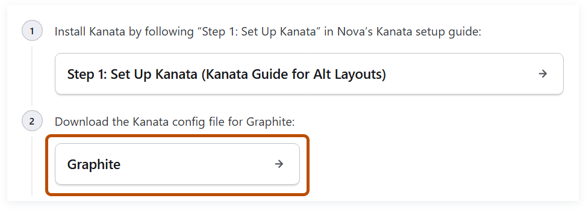
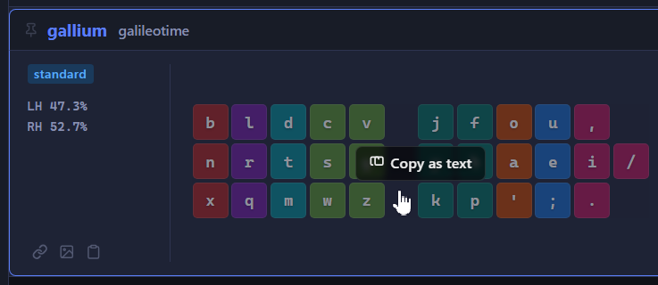

# Kanata Guide for Alt Layouts

[Alternative keyboard layouts (alt layouts)](https://layouts.wiki/guides/start/intro/) make using computers more comfortable. [Kanata](https://github.com/jtroo/kanata) is software that lets you use an alt layout on any keyboard&NoBreak;&hairsp;&NoBreak;&mdash;&hairsp;no hardware changes needed.

This guide shows you how to use Kanata to set up and customize an alt layout on your keyboard. The pre-made configs add features to an alt layout like QWERTY shortcuts, toggling to QWERTY, symbol and navigation layers, and magic keys and adaptive swaps.

You can use this guide even if you don’t have any programming experience.

### In this guide

-   [Why use Kanata for alt layouts?](#why-use-kanata-for-alt-layouts)
-   [Supported platforms](#supported-platforms)
-   [Step 1: Set up Kanata](#step-1-set-up-kanata)
-   [Step 2: Run an alt layout](#step-2-run-an-alt-layout)
-   [Step 3: Change your layout](#step-3-change-your-layout)
-   [Automatically start Kanata](#automatically-start-kanata)
-   [Pre-made configs](#pre-made-configs)

## Why use Kanata for alt layouts?

-   Kanata and all its features are completely free to use.
-   Kanata is open source&NoBreak;&hairsp;&NoBreak;&mdash;&hairsp;anyone can view exactly how it works.
-   Kanata works on any keyboard, including laptop keyboards.
-   Kanata lets you add quality-of-life features and advanced features to an alt layout&NoBreak;&hairsp;&NoBreak;&mdash;&hairsp;see this guide’s [Pre-made configs](#pre-made-configs).
-   Kanata lets you use the same config file on Windows, Linux, and macOS.
-   Kanata has an active community on the [Alt Keyboard Layouts Discord](https://discord.gg/4kVZu7uWdy) that can answer any question you have.

## Supported platforms

-   Windows 10 or newer
-   Linux
-   macOS 13 or newer

Older versions of Windows and macOS aren’t supported by this guide.

## Step 1: Set up Kanata

Expand the section for your platform.

<details>
<summary><strong>Windows</strong></summary>
<p></p>

1.  Download Kanata:

    -   [x64 download](https://github.com/jtroo/kanata/releases/latest/download/windows-binaries-x64.zip)
    -   [arm64 download](https://github.com/jtroo/kanata/latest/download/windows-binaries-arm64.zip)

    <blockquote>
    <p>

    If you’re not sure which to download, see this guide’s [Windows: Check if your computer is x64 or arm64](#windows-check-if-your-computer-is-x64-or-arm64).

    </p>
    </blockquote>

1.  Extract the downloaded zip file. It contains the Kanata executable files.

1.  [Download the example config](https://github.com/zachpoblete/kanata-guide-for-alt-layouts/releases/download/download/example-config.kbd).

1.  Save the example config to the folder containing the Kanata executable files.

</details>

<details>
<summary><strong>Linux</strong></summary>
<p></p>

1.  [Download Kanata](https://github.com/jtroo/kanata/releases/latest/download/linux-binaries-x64.zip).

1.  Extract the downloaded zip file. It contains the Kanata executable files.

1.  [Download the example config](https://github.com/zachpoblete/kanata-guide-for-alt-layouts/releases/download/download/example-config.kbd).

1.  Save the example config to the folder containing the Kanata executable files.

</details>

<details>
<summary><strong>macOS</strong></summary>
<p></p>

If you encounter any issues, see [Troubleshooting](https://github.com/jtroo/kanata/blob/main/docs/setup-macos.md#8-troubleshooting).

### Step 1: Set up the Karabiner driver

To use Kanata, first set up the [Karabiner driver](https://github.com/pqrs-org/Karabiner-DriverKit-VirtualHIDDevice):

1.  If you have [Karabiner Elements](https://karabiner-elements.pqrs.org/) installed, see this guide’s [macOS: Disable Karabiner Elements Privileged Daemons](#macos-disable-karabiner-elements-privileged-daemons).

    **Note:** It isn’t possible to run both Kanata and Karabiner Elements at the same time.

1.  [Download Karabiner driver v6.2.0](https://github.com/pqrs-org/Karabiner-DriverKit-VirtualHIDDevice/releases/download/v6.2.0/Karabiner-DriverKit-VirtualHIDDevice-6.2.0.pkg). You must download v6.2.0 because that is the version supported by Kanata.

1.  Run the Karabiner driver installer.

1.  Open a terminal.

    >   If you’re not sure how, see this guide’s [macOS: Open a terminal](#macos-open-a-terminal).

1.  In the terminal, activate the driver:

    ```shell
    sudo /Applications/.Karabiner-VirtualHIDDevice-Manager.app/Contents/MacOS/Karabiner-VirtualHIDDevice-Manager forceActivate
    ```

    >   If you’re not sure how to run a terminal command, see [Run a command from this guide](#run-a-command-from-this-guide).

1.  Enable the Karabiner system extension:

    1.  Open the **System Settings** app.

    1.  Click **General > Login Items & Extensions**.

    1.  In **Extensions**, enable **.Karabiner-VirtualHIDDevice-Manager**.

1.  [Download the Karabiner plist file](https://github.com/zachpoblete/kanata-guide-for-alt-layouts/releases/download/download/org.pqrs.Karabiner-VirtualHIDDevice-Daemon.plist).

1.  Save the Karabiner plist file to the `/Library/LaunchDaemons` folder.

1.  In the terminal, register the Karabiner daemon:

    ```shell
    sudo chown root:wheel /Library/LaunchDaemons/org.pqrs.Karabiner-VirtualHIDDevice-Daemon.plist
    sudo launchctl bootstrap system /Library/LaunchDaemons/org.pqrs.Karabiner-VirtualHIDDevice-Daemon.plist
    sudo launchctl list | grep org.pqrs
    ```

    The output lists the Karabiner daemon `org.pqrs.service.daemon.Karabiner-VirtualHIDDevice-Daemon`.

### Step 2: Set up the Kanata executable file

1.  Download Kanata:

    -   [arm64 download](https://github.com/jtroo/kanata/releases/latest/download/macos-binaries-arm64.zip)
    -   [x64 download](https://github.com/jtroo/kanata/releases/latest/download/macos-binaries-x64.zip)

    <blockquote>
    <p>

    If you’re not sure which to download, see this guide’s [macOS: Check if your computer is arm64 or x64](#macos-check-if-your-computer-is-arm64-or-x64).

    </p>
    </blockquote>

1.  Extract the downloaded zip file. It contains the Kanata executable files.

1.  Enable **Accessibility**:

    1.  Open the **System Settings** app.

    1.  Click **Privacy & Security > Accessibility**.

    <ol start="3">
    <li><a name="enable-accesibility-add-kanata"></a>Add Kanata:

    1.  Click **+**.

    1.  Search for the Kanata executable file whose filename starts with `kanata_macos_cmd_allowed_`.

    1.  Select the Kanata executable file.

    1.  Click **Open**.

    </li>
    </ol>

    <ol start="4">
    <li><a name="enable-accesibility-add-your-terminal"></a>If you use the native Terminal and <strong>Terminal</strong> isn’t in the list of apps; or you use a third-party terminal and it isn’t in the list of apps; follow these steps:

    1.  Click **+**.

    1.  Search for your terminal.

    1.  Select your terminal.

    1.  Click **Open**.

    </li>
    </ol>

1.  Enable **Input Monitoring**:

    1.  In the **System Settings** app, click **Privacy & Security > Input Monitoring**.

    1.  [Add Kanata as you did in the Enable Accesibility step](#enable-accesibility-add-kanata).

    1.  If your terminal isn’t in the list of apps, [add your terminal as you did in the Enable Accesibility step](#enable-accesibility-add-your-terminal).

### Step 3: Set up the example config

1.  [Download the example config](https://github.com/zachpoblete/kanata-guide-for-alt-layouts/releases/download/download/example-config.kbd).

1.  Save the example config to the folder containing the Kanata executable files.

</details>

## Step 2: Run an alt layout

Expand the section for your platform.

<details>
<summary><strong>Windows</strong></summary>
<p></p>

1.  Open a terminal in the folder containing the Kanata executable files.

    >   If you’re not sure how, right-click an empty space inside the folder and select **Open in Terminal**.

1.  In the terminal, run the example config:

    ```cmd
    .\kanata_windows_gui_winIOv2_cmd_allowed_x64 --cfg example-config.kbd --nodelay
    ```

    If your computer is arm64, replace `x64` with `arm64`.

    <blockquote>
    <p>

    If you’re not sure how to run a terminal command, see [Run a command from this guide](#run-a-command-from-this-guide).

    </p>
    </blockquote>

Kanata is running the [Gallium layout](https://layouts.wiki/guides/start/recommendations/#gallium-and-graphite). Press your `q` key&NoBreak;&hairsp;&NoBreak;&mdash;&hairsp;it outputs `b`.

**To stop running Kanata**, press the key combination `Left Control + Space + Escape`. Use the physical keys in those positions&NoBreak;&hairsp;&NoBreak;&mdash;&hairsp;it doesn’t matter what you configured those keys to do.

</details>

<details>
<summary><strong>Linux</strong></summary>
<p></p>

1.  Open a terminal in the folder containing the Kanata executable files.

    >   If you’re not sure how, right-click an empty space inside the folder and select **Open in Terminal**.

1.  In the terminal, run the example config. You only need to run the `chmod` command the first time you run Kanata.

    ```shell
    chmod +x kanata_linux_cmd_allowed_x64
    sudo ./kanata_linux_cmd_allowed_x64 --cfg example-config.kbd --nodelay
    ```

    >   If you’re not sure how to run a terminal command, see [Run a command from this guide](#run-a-command-from-this-guide).

Kanata is running the [Gallium layout](https://layouts.wiki/guides/start/recommendations/#gallium-and-graphite). Press your `q` key&NoBreak;&hairsp;&NoBreak;&mdash;&hairsp;it outputs `b`.

**To stop running Kanata**, press the key combination `Left Control + Space + Escape`. Use the physical keys in those positions&NoBreak;&hairsp;&NoBreak;&mdash;&hairsp;it doesn’t matter what you configured those keys to do.

</details>

<details>
<summary><strong>macOS</strong></summary>
<p></p>

If you encounter any issues, see [Troubleshooting](https://github.com/jtroo/kanata/blob/main/docs/setup-macos.md#8-troubleshooting).

1.  Open a terminal in the folder containing the Kanata executable files.

    >   If you’re not sure how, see this guide’s [macOS: Open a folder in a terminal](#macos-open-a-folder-in-a-terminal).

1.  In the terminal, run the example config. You only need to run the `chmod` command the first time you run Kanata.

    ```shell
    chmod +x kanata_macos_cmd_allowed_arm64
    sudo ./kanata_macos_cmd_allowed_arm64 --cfg example-config.kbd --nodelay
    ```

    If your computer is x64, replace `arm64` with `x64`.

Kanata is running the [Gallium layout](https://layouts.wiki/guides/start/recommendations/#gallium-and-graphite). Press your `q` key&NoBreak;&hairsp;&NoBreak;&mdash;&hairsp;it outputs `b`.

**To stop running Kanata**, press the key combination `Left Control + Space + Escape`. Use the physical keys in those positions&NoBreak;&hairsp;&NoBreak;&mdash;&hairsp;it doesn’t matter what you configured those keys to do.

</details>

## Step 3: Change your layout

If you want to use an existing layout, follow these steps:

1.  Open the [Layouts Wiki](https://layouts.wiki/layouts/legacy/qwerty).

1.  In the **Search** box, enter the name of the layout.

    If an **Install** result for your layout appears, expand this guide’s **Use an existing layout**; otherwise, expand this guide’s **Modify the example config**.

<details>
<summary><strong>Use an existing layout</strong></summary>
<p></p>

1.  Click the **Install** result. The **Install** section appears.

1.  In the 2nd step of the **Install** section, click the layout.

    <picture>
      <source media="(prefers-color-scheme: dark)" srcset="images/layouts-wiki-download-kanata-config-screenshot.png">
      
    </picture>

1.  In the plain text page that appears, save the plain text page as a config file: press `Control + S` (or `Command + S` on macOS).

    1.  Save the config to the folder containing the Kanata executable files.

    1.  Click **Save**.

1.  Open a terminal in the folder containing the Kanata executable files.

1.  Run the config like you ran the example config in [Run an alt layout](#step-2-run-an-alt-layout): in the command, replace `example-config.kbd` with the filename of the config.

</details>

</details>

<details>
<summary><strong>Modify the example config</strong></summary>
<p></p>

### Step 1: Learn how the example config works

-   To learn learn how the example config works, see this guide’s [The `defsrc` and `deflayer` entries](#the-defsrc-and-deflayer-entries).

### Step 2: Edit the example config

1.  Open the example config with a plain text editor.

    >   If you’re not sure how, see this guide’s [Open a file with a plain text editor](#open-a-file-with-a-plain-text-editor).

1.  To remap keys that aren’t in the `defsrc` entry, add those keys to the `defsrc` entry.

1.  In the `deflayer` entry, rename the `gallium` layer to the name of your layout.

1.  In the `deflayer` entry, edit the keys to match your layout&NoBreak;&hairsp;&NoBreak;&mdash;&hairsp;if your layout already exists, see this guide’s [Copy an existing layout into a `deflayer` entry](#copy-an-existing-layout-into-a-deflayer-entry).

1.  If the number of keys of the `defsrc` and `deflayer` entries don’t match, add or remove keys as needed.

1.  Optional: To align the keys in the `deflayer` entry to the keys in the `defsrc` entry, add or remove space characters.

1.  Save the file.

### Step 3: Run your layout

1.  Open a terminal in the folder containing the Kanata executable files.

1.  Run the example config as you did in [Run an alt layout](#step-2-run-an-alt-layout).

</details>

## Automatically start Kanata

Expand the section for your platform.

<details>
<summary><strong>Windows</strong></summary>
<p></p>

1.  Open the startup folder.

    >   If you’re not sure how, see this guide’s [Windows: Open the startup folder](#windows-open-the-startup-folder).

1.  Create a shortcut of a Kanata executable file.

    >   If you’re not sure how: in the folder containing the Kanata executable file, hold the `Alt` key and drag the file anywhere inside the folder.

1.  Move the shortcut of the Kanata executable file to the startup folder.

1.  Right-click the shortcut and select **Properties**.

1.  In **Target**, add the following arguments:

    ```
     --cfg "KANATA_CONFIG_PATH" --nodelay
    ```

    Replace `KANATA_CONFIG_PATH` with the path to your Kanata config file&NoBreak;&hairsp;&NoBreak;&mdash;&hairsp;for example, `C:\Users\username\Documents\Kanata\config.kbd`.

    The full **Target** is similar to the following:

    <pre>
    "KANATA_EXECUTABLE_PATH" --cfg "KANATA_CONFIG_PATH" --nodelay
    </pre>

    `KANATA_EXECUTABLE_PATH` is the path to the Kanata executable file&NoBreak;&hairsp;&NoBreak;&mdash;&hairsp;for example, `C:\Program Files\Kanata\kanata_windows_gui_winIOv2_cmd_allowed_x64.exe`.

1. Click **OK**.

1. To verify the shortcut runs properly, double-click the shortcut and test a remapped key.

</details>

<details>
<summary><strong>Linux</strong></summary>
<p></p>

1.  [Download the Kanata service file](https://github.com/zachpoblete/kanata-guide-for-alt-layouts/releases/download/download/kanata.service).

1.  Save the Kanata service file to the `/etc/systemd/system/` folder.

1.  Open the Kanata service file with a plain text editor.

1.  Edit the following line:

    <pre>
    ExecStart=KANATA_EXECUTABLE_PATH --cfg KANATA_CONFIG_PATH --nodelay
    </pre>

    Replace the following:

    -   `KANATA_EXECUTABLE_PATH`: the path to a Kanata executable file&NoBreak;&hairsp;&NoBreak;&mdash;&hairsp;for example, `/usr/local/bin/kanata_linux_cmd_allowed_x64`
    -   `KANATA_CONFIG_PATH`: the path to your Kanata config file&NoBreak;&hairsp;&NoBreak;&mdash;&hairsp;for example, `/home/username/Documents/Kanata/config.kbd`

1.  Save the file.

1.  Open a terminal.

    >   If you’re not sure how, press `Control + Alt + T`.

1.  In the terminal, enable the Kanata service:

    ```shell
    sudo systemctl enable kanata.service
    ```

</details>

<details>
<summary><strong>macOS</strong></summary>
<p></p>

1.  [Download the Kanata plist file](https://github.com/zachpoblete/kanata-guide-for-alt-layouts/releases/download/download/dev.kanata.kanata.plist).

1.  Save the Kanata plist file to the `/Library/LaunchDaemons` folder.

1.  Open the Kanata plist file with a plain text editor.

1.  Edit the `ProgramArguments` key:

    <pre>
        &lt;key&gt;ProgramArguments&lt;/key&gt;
        &lt;array&gt;
            &lt;string&gt;KANATA_EXECUTABLE_PATH&lt;/string&gt;
            &lt;string&gt;--cfg&lt;/string&gt;
            &lt;string&gt;KANATA_CONFIG_PATH&lt;/string&gt;
            &lt;string&gt;--nodelay&lt;/string&gt;
        &lt;/array&gt;
    </pre>

    Replace the following:

    -   `KANATA_EXECUTABLE_PATH`: the path to a Kanata executable file&NoBreak;&hairsp;&NoBreak;&mdash;&hairsp;for example, `/usr/local/bin/kanata_macos_cmd_allowed_arm64`
    -   `KANATA_CONFIG_PATH`: the path to your Kanata config file&NoBreak;&hairsp;&NoBreak;&mdash;&hairsp;for example, `/Users/username/Documents/Kanata/config.kbd`

1.  Save the file.

1.  Open a terminal.

1.  In the terminal, register the Kanata daemon:

    ```shell
    sudo chown root:wheel /Library/LaunchDaemons/dev.kanata.kanata.plist
    sudo launchctl bootstrap system /Library/LaunchDaemons/dev.kanata.kanata.plist
    launchctl list | grep dev.kanata
    ```

    The output lists the Kanata daemon `dev.kanata.kanata`.

</details>

## Pre-made configs

To run one of the configs, see this guide’s [Run one of the pre-made configs](#run-one-of-the-pre-made-configs).

To learn about the basics of a config, see this guide’s [Basics of a Kanata config](#basics-of-a-kanata-config)

To learn about any Kanata feature used in a config, see the [Kanata Configuration Guide](https://jtroo.github.io/config.html).

#### In this section

-   [General features](#general-features)
-   [Home row mods](#home-row-mods)
-   [Symbol and navigation layers](#symbol-and-navigation-layers)
-   [Layouts](#layouts)
-   [Small layouts](#small-layouts)
-   [Chorded layouts](#chorded-layouts)
-   [Layouts with multiple alpha layers](#layouts-with-multiple-alpha-layers)
-   [Magic keys and adaptive swaps](#magic-keys-and-adaptive-swaps)

### General features

-   [`hold-backtick-to-switch-layouts.kbd`](configs/hold-backtick-to-switch-layouts.kbd)
    -   Toggles between your alt layout and QWERTY when you hold the backtick `` ` `` key
-   [`gallium-with-qwerty-shortcuts.kbd`](configs/gallium-with-qwerty-shortcuts.kbd)
    -   Uses QWERTY shortcuts when you hold any modifier key, such as `Control`
-   [`gallium-with-compose.kbd`](configs/gallium-with-compose.kbd)
    -   Layout with a [compose key](https://en.wikipedia.org/wiki/Compose_key)

### Home row mods

-   [`gallium-with-home-row-mods.kbd`](configs/gallium-with-home-row-mods.kbd)
    -   Layout with [home row mods](https://getreuer.info/posts/keyboards/tour/index.html#home-row-mods)
-   [`gallium-with-qwerty-home-row-mods.kbd`](configs/gallium-with-qwerty-home-row-mods.kbd)
    -   Layout with home row mods that use QWERTY

### Symbol and navigation layers

These layers often use [transparent keys](https://jtroo.github.io/config.html#transparent-key).

-   [`gallium-with-symbol-layer.kbd`](configs/gallium-with-symbol-layer.kbd)
    -   Layout with a 2nd layer for symbol keys
-   [`gallium-with-navigation-layer.kbd`](configs/gallium-with-navigation-layer.kbd)
    -   Layout with a 2nd layer for navigation keys

### Layouts

-   [`graphite.kbd`](configs/graphite.kbd)
    -   Layout with custom shift pairs
-   [`night.kbd`](configs/night.kbd)
    -   Layout with a [thumb alpha key](https://layouts.wiki/guides/start/recommendations/#thumb-alpha)
-   [`night-wide.kbd`](configs/night-wide.kbd)
    -   Layout with [wide mod](https://colemakmods.github.io/ergonomic-mods/wide.html)
-   [`night-double-wide.kbd`](configs/night-double-wide.kbd)
    -   Layout with wide mod applied twice
-   [`nastic.kbd`](configs/nastic.kbd)
    -   Layout with duplicate keys

### Small layouts

-   [`taipo.kbd`](configs/taipo.kbd)
    -   Layout that can be used with 1 hand
-   [`buggy.kbd`](configs/buggy.kbd)
    -   Layout with 2 alpha layers
-   [`2-row-gallium.kbd`](configs/2-row-gallium.kbd)
    -   Layout with only 2 rows
-   [`crescent.kbd`](configs/crescent.kbd)
    -   Layout with only 10 keys, one for each finger

### Chorded layouts

-   [`gallium-with-combos.kbd`](configs/gallium-with-combos.kbd)
    -   Layout with combos
-   [`taipo.kbd`](configs/taipo.kbd)
    -   Layout that can be used with 1 hand

### Layouts with multiple alpha layers

-   [`lucens.kbd`](configs/lucens.kbd)
    -   Layout with a 2nd layer for German letters
-   [`buggy.kbd`](configs/buggy.kbd)
    -   Layout with 2 alpha layers
-   [`power.kbd`](configs/power.kbd)
    -   Layout with 162 layers

### Magic keys and adaptive swaps

-   [`whirl.kbd`](configs/whirl.kbd)
    -   Layout with a [magic key](https://layouts.wiki/reference/terminology/magic/)
-   [`afterburner.kbd`](configs/afterburner.kbd)
    -   Layout with a skip magic key
-   [`nordrassil.kbd`](configs/nordrassil.kbd)
    -   Layout with [chiral magic keys](https://github.com/zachpoblete/alt-layout-glossary#chiral-magic-keys)
-   [`d5.kbd`](configs/d5.kbd)
    -   Layout with chiral skip magic keys
-   [`adaptive-sturdy.kbd`](configs/adaptive-sturdy.kbd)
    -   Layout with [adaptive swaps](https://dario.ca/posts/2026-05-18-keyboard-layout-adaptive-swaps/)

## Basics of a Kanata config

This section helps you customize this guide’s [Pre-made configs](#pre-made-configs).

#### In this section

-   [The `defsrc` and `deflayer` entries](#the-defsrc-and-deflayer-entries)
-   [Comments](#comments)
-   [Lists](#lists)
-   [Actions](#actions)
-   [Aliases](#aliases)
-   [Variables](#variables)

### The `defsrc` and `deflayer` entries

The [example config](configs/example-config.kbd) shows the two required entries of a config, `defsrc` and `deflayer`:

```
(defsrc
  q w e r t  y u i o p
  a s d f g  h j k l ; '
  z x c v b  n m , . /
)

(deflayer gallium
  b l d c v  j f o u ,
  n r t s g  y h a e i /
  x q m w z  k p ' ; .
)
```

The `defsrc` entry lists the physical keys of your keyboard.

The `deflayer` entry creates a keyboard layer named `gallium`.

**How Kanata remaps your keyboard**: Kanata remaps each physical key in the `defsrc` entry to a key or action in the same position in the `gallium` layer. For example, Kanata remaps `q` in the `defsrc` entry to `b` in the `gallium` layer.

For key names you can use in the `defsrc` and `deflayer` entries, see this guide’s [Key names for the `defsrc` and `deflayer` entries](#key-names-for-the-defsrc-and-deflayer-entries).

### Comments

Kanata ignores comments.

Comments are prefixed with two semicolons `;;`&NoBreak;&hairsp;&NoBreak;&mdash;&hairsp;for example:

```
;; This is a comment.

(defsrc
  caps a s d f  ;; Comments can be added to the end of a line.
)
```

### Lists

Configs are made of lists.

Lists have the form `(item1 item2 item3 ...)`. The parentheses `()` group related items together. Items are separated by whitespace.

Usually, the first item is a command and the rest are arguments, such as in the `defsrc` and `deflayer` entries.

### Actions

Actions let you go beyond remapping a key to a different key.

The following example maps `Caps Lock` to the [`tap-hold` action](https://jtroo.github.io/config.html#tap-hold), letting you activate `Left Control` by holding `Caps Lock`:

```
(defsrc
  caps a s d f
)

(deflayer example
  (tap-hold 200 200 caps lctl) a s d f
)
```

### Aliases

Aliases are named shortcuts for actions.

Aliases are defined in a `defalias` entry:

```
(defalias
  alias1-name alias1-action
  alias2-name alias2-action
  ...
)
```

Each line is a pair&NoBreak;&hairsp;&NoBreak;&mdash;&hairsp;an alias name followed by an action the alias maps to. An alias is used by prefixing the alias name with `@`.

The following example uses an alias for the `tap-hold` action:

```
(defalias
  caps (tap-hold 200 200 caps lctl)
)

(deflayer example
  @caps a s d f
)
```

Aliases let you visually align your `defsrc` and `deflayer` entries, making your config easier to read and maintain&NoBreak;&hairsp;&NoBreak;&mdash;&hairsp;for example:

```
(defsrc
   caps a s d f
)

(deflayer example
  @caps a s d f
)
```

### Variables

Variables are named shortcuts for strings or lists.

Variables are defined in a `defvar` entry:

```
(defvar
  variable1-name variable1-value
  variable2-name variable2-value
  ...
)
```

Each line is a pair&NoBreak;&hairsp;&NoBreak;&mdash;&hairsp;a variable name followed by the value the variable maps to. A variable is used by prefixing the variable name with `$`.

The following example uses variables for the numbers in the `tap-hold` action:

```
(defvar
  tap-time  200
  hold-time 200
)

(defalias
  caps (tap-hold $tap-time $hold-time caps lctl)
)
```

## Key names for the `defsrc` and `deflayer` entries

For key names you can use in the `defsrc` and `deflayer` entries, see the following references:

-   For common keys, see the [60% US keyboard config](configs/us-keyboard.kbd).
-   For other keys, see [Key names](https://jtroo.github.io/config.html#key-names).
-   For keys not found on the US keyboard, see [Non-US keyboards](https://jtroo.github.io/config.html#non-us-keyboards) and [Keyboard locales](https://github.com/jtroo/kanata/blob/main/docs/locales.adoc).

## Mini guides

### Copy an existing layout into a `deflayer` entry

1.  Open the [cmini browser](https://cminibrowser.com/) website.

1.  In the **Search** box, enter the name of the layout.

1.  Click the row of the layout.

1.  To copy the layout, click the graphic of the layout that appears.

    

1.  Open your config with a plain text editor.

1.  Paste the layout into a `deflayer` entry.

### Open a file with a plain text editor

#### Windows

-   Right-click the file and select **Edit in Notepad**.

#### Linux

-   Right-click the file and select the command to open with a text editor.

#### macOS

-   Right-click the file and select **Open with > TextEdit**.

### Run a command from this guide

1.  To copy the command, click **Copy code to clipboard**.

1.  Click in the terminal window.

1.  Paste the command:

    -   Windows: Press `Control + V`.
    -   Linux: Press `Control + Shift + V`.
    -   macOS: Press `Command + V`.

1.  If the command has any placeholders, follow the command’s instructions on how to replace them.

1.  To run the command, press `Enter`.

1.  If you’re on Linux or macOS and the command starts with `sudo`, the command requires administrator privileges and you may be prompted to enter your password:

    1.  Enter your password&NoBreak;&hairsp;&NoBreak;&mdash;&hairsp;as you type it, nothing will appear on screen, which is normal.

    1.  Press `Enter`.

>   [!TIP]
>   To reuse a command you’ve already ran: in the terminal, press **Up arrow**.

### Run one of the pre-made configs

1.  Download one of the configs from this guide’s [Pre-made configs](#pre-made-configs):

    1.  Open the link of the config you want to download.

    1.  To download the config, click <picture><source media="(prefers-color-scheme: dark)" srcset="images\github-download-raw-file-icon-light.svg"></picture>.

        <picture>
          <source media="(prefers-color-scheme: dark)" srcset="images\github-download-raw-file-screenshot.png">
          
        </picture>

1.  Save the config to the folder containing the Kanata executable files.

1.  Open a terminal in the folder containing the Kanata executable files.

1.  Run the config like you ran the example config in [Run an alt layout](#step-2-run-an-alt-layout): in the command, replace `example-config.kbd` with the filename of the config.

### Windows: Check if your computer is x64 or arm64

1.  Open the **Settings** app.

1.  Click **System > About**.

1.  In **Device info**, look for **System type**:

    -   If it says **64-bit operating system, _x64_-based processor**, your computer is **x64**.
    -   If it says **64-bit operating system, _ARM_-based processor**, your computer is **arm64**.

### Windows: Open the startup folder

1.  Press `Windows + R`.

1.  Enter `shell:startup`

1.  Click **OK**.

### macOS: Check if your computer is arm64 or x64

1.  Click the **Apple** menu and select **About This Mac**.

1.  Look for either **Chip** or **Processor**:

    -   **Chip** means your computer is **arm64**.
    -   **Processor** means your computer is **x64**.

### macOS: Disable Karabiner Elements Privileged Daemons

1.  Open the **System Settings** app.

1.  Click **General > Login Items & Extensions**.

1.  In **App Background Activity**, disable the following if you see them:

    -   **Karabiner-Elements Privileged Daemons**
    -   **Karabiner-Elements Privileged Daemons v2**

### macOS: Open a terminal

1.  Press `Command + Space`.

1.  Enter `terminal`.

1.  Double-click **Terminal**.

### macOS: Open a folder in a terminal

-   Right-click an empty space inside the folder and select **Services > New Terminal at Folder**.

    If **New Terminal at Folder** doesn’t appear, click **Finder > Services > Services Settings > Files and Folders** and enable **New Terminal at Folder**.

## Feedback

Found an issue or have a question? [Open an issue](https://github.com/zachpoblete/kanata-guide-for-alt-layouts/issues) or reach out on the [Alt Keyboard Layouts Discord](https://discord.gg/4kVZu7uWdy)&NoBreak;&hairsp;&NoBreak;&mdash;&hairsp;feel free to mention @novachromatic, the owner of this guide.
