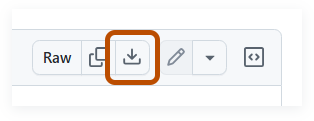

# Reference Guides

This page contains guides referenced throughout the [main guide](https://github.com/zachpoblete/kanata-guide-for-keyboard-layouts).

## Copy an existing layout into a `deflayer` entry

1.  Open [cmini browser](https://cminibrowser.com/).

1.  In the **Search** box, enter the name of the layout.

1.  Click the row of the layout.

1.  To copy the layout, click the graphic of the layout that appears.

    

1.  Open your config with a plain text editor.

1.  Paste the layout into a `deflayer` entry.

## Open a file with a plain text editor

### Windows

-   Right-click the file and select **Edit in Notepad**.

### Linux

-   Right-click the file and select the command to open with a text editor.

### macOS

-   Right-click the file and select **Open with > TextEdit**.

## Remap a key to a Unicode character

1.  Read [Basics of a Kanata Config](config-basics.md).

1.  Use the [`unicode` action](https://jtroo.github.io/config.html#unicode). For an example of using the `unicode` action, see the [`lucens-german-only.kbd` config](../configs/lucens-german-only.kbd).

## Run a command from this guide

1.  Copy the command.

1.  Click in the terminal window.

1.  Paste the command:

    -   Windows: Press `Control + V`.
    -   Linux: Press `Control + Shift + V`.
    -   macOS: Press `Command + V`.

1.  If the command has any placeholders, follow the command’s instructions on how to replace them.

1.  To run the command, press `Enter`.

1.  If you’re on Linux or macOS and the command starts with `sudo`, the command needs administrator privileges. You might be prompted to enter your password:

    1.  Enter your password&NoBreak;&hairsp;&NoBreak;&mdash;&hairsp;as you type it, nothing will appear on screen; this is normal.

    1.  Press `Enter`.

>   [!TIP]
>   To reuse a command you’ve already ran: in the terminal, press **Up arrow**.

## Run a pre-made config

1.  Open the link of the [pre-made config](https://github.com/zachpoblete/kanata-guide-for-keyboard-layouts/tree/main#pre-made-configs) you want to download.

1.  To download the config, click <picture><source media="(prefers-color-scheme: dark)" srcset="../images/github-download-raw-file-icon-light.svg"></picture>&nbsp;**Download raw file**.

    <picture>
        <source media="(prefers-color-scheme: dark)" srcset="../images/github-download-raw-file-screenshot.png">
        
    </picture>

1.  Save the config to the folder containing the Kanata executable files.

1.  Run the config like you [ran the example config in the Run Kanata step](https://github.com/zachpoblete/kanata-guide-for-keyboard-layouts/tree/main#step-2-run-kanata): in the command, replace `example-config.kbd` with the filename of the config.

## Windows: Check if your computer is x64 or arm64

1.  Open the **Settings** app.

1.  Click **System > About**.

1.  In **Device info**, look for **System type**:

    -   If it says **64-bit operating system, _x64_-based processor**, your computer is **x64**.
    -   If it says **64-bit operating system, _ARM_-based processor**, your computer is **arm64**.

## Windows: Open the startup folder

1.  Press `Windows + R`.

1.  Enter `shell:startup`

1.  Click **OK**.

## macOS: Check if your computer is arm64 or x64

1.  Click the **Apple** menu and select **About This Mac**.

1.  Look for either **Chip** or **Processor**:

    -   **Chip** means your computer is **arm64**.
    -   **Processor** means your computer is **x64**.

## macOS: Disable Karabiner Elements Privileged Daemons

1.  Open the **System Settings** app.

1.  Click **General > Login Items & Extensions**.

1.  In **App Background Activity**, disable the following if you see them:

    -   **Karabiner-Elements Privileged Daemons**
    -   **Karabiner-Elements Privileged Daemons v2**

## macOS: Open a terminal

1.  Press `Command + Space`.

1.  Enter `terminal`.

1.  Double-click **Terminal**.

## macOS: Open a folder in a terminal

1.  Right-click an empty space inside the folder and select **Services > New Terminal at Folder**.

1.  If **New Terminal at Folder** doesn’t appear, follow these steps:

    1.  Click **Finder > Services > Services Settings > Files and Folders**.

    1.  Enable **New Terminal at Folder**.
